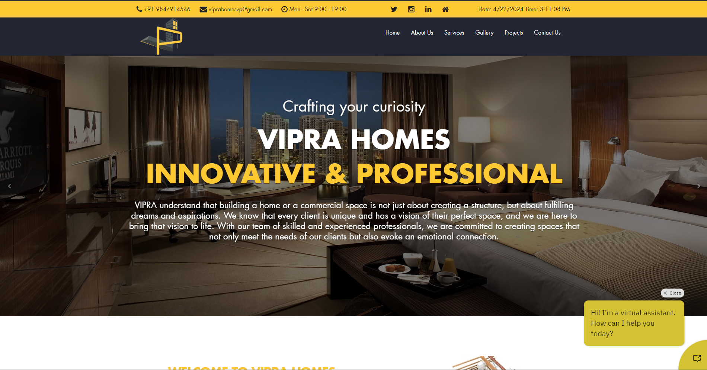

# Vipra Home Chatbot

Welcome to the Vipra Home Chatbot project! This repository contains the source code for a static chatbot designed specifically for assisting users with inquiries related to Vipra Home products and services.

## About

The Vipra Home Chatbot is a static chatbot solution built to enhance user experience by providing instant support and information. It utilizes predefined responses and conversation flows to address common user queries.

## Features

- Static chatbot interface for providing predefined responses.
- Designed to seamlessly integrate with the Vipra Home website.
- Provides quick and relevant answers to user inquiries.
- Enhances user engagement and satisfaction with instant support.

## Technologies Used

- HTML, CSS, and JavaScript for building the static chatbot interface.
- Integration with Vipra Home website using simple embedding methods.
- Custom styling and branding to match the Vipra Home website's design.

## Usage

1. Integrate the static chatbot interface with the Vipra Home website.
2. Users can interact with the chatbot by typing queries and receiving predefined responses.
3. Enhance the chatbot's capabilities by updating the predefined responses and conversation flows as needed.

## Live Demo

Check out the live demo [here](https://tidkeashok007.github.io/viprahomes_with_chatbot/).

## Contributing

Contributions are welcome! If you have suggestions, bug fixes, or new features to propose, please feel free to open an issue or submit a pull request.

## License

This project is licensed under the [MIT License](LICENSE).

## Contact

For any inquiries or support, please contact us at [ashok93tidke@gmail.com](mailto:ashok93tidke@gmail.com).
